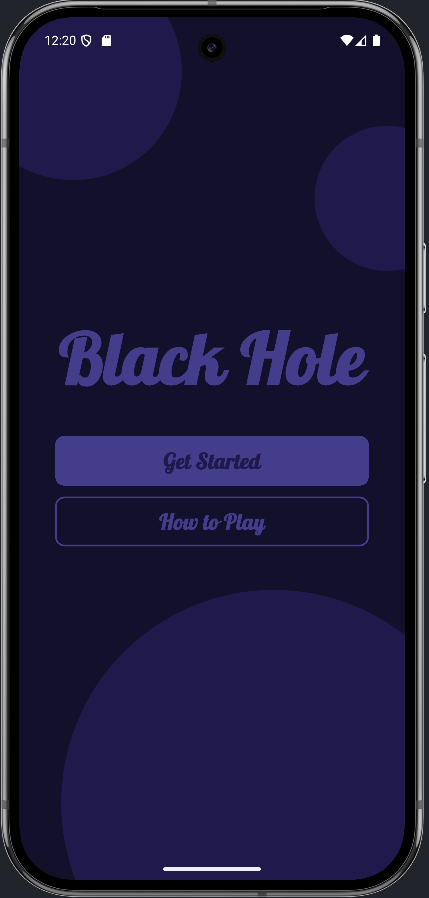
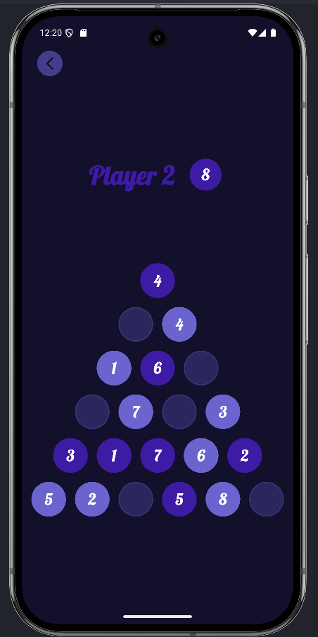
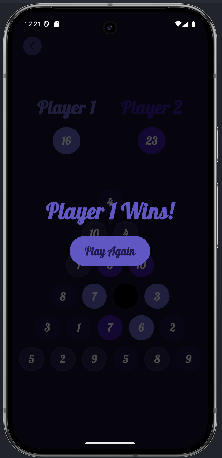

# 🕳️ Black Hole  

A simple yet strategic two-player number placement game built with **Flutter** and enriched with **smooth animations** for a more engaging experience.  

## 🎮 Game Rules  

- Two players take turns placing numbers (from 1 to 10) into holes.  
- One hole will always remain unvisited — **the Black Hole**.  
- When no moves remain, the game ends.  
- **Scoring**:  
  - Look at the holes adjacent to the Black Hole.  
  - Sum Player 1’s numbers on those adjacent holes.  
  - Sum Player 2’s numbers on those adjacent holes.  
  - **The player with the smaller sum wins!**  

## ✨ Features  

- Interactive 2-player gameplay on the same device.  
- **Smooth animations** for moves, transitions, and interactions.  
- Simple rules but deep strategy.  
- Clean UI powered by Flutter.  

## 📦 Download  

👉 You can grab the latest release [here](https://github.com/Al-Hussein-Mohamed/black-hole/releases).  

## 📸 Screenshots

Here’s a look at the gameplay:  

| Home | Game Board | Black Hole Endgame |
|------------|-------------|---------------------|
|  |  |  |
